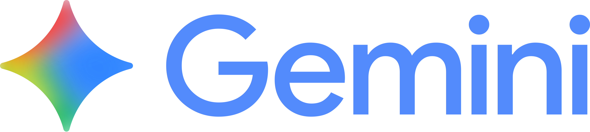
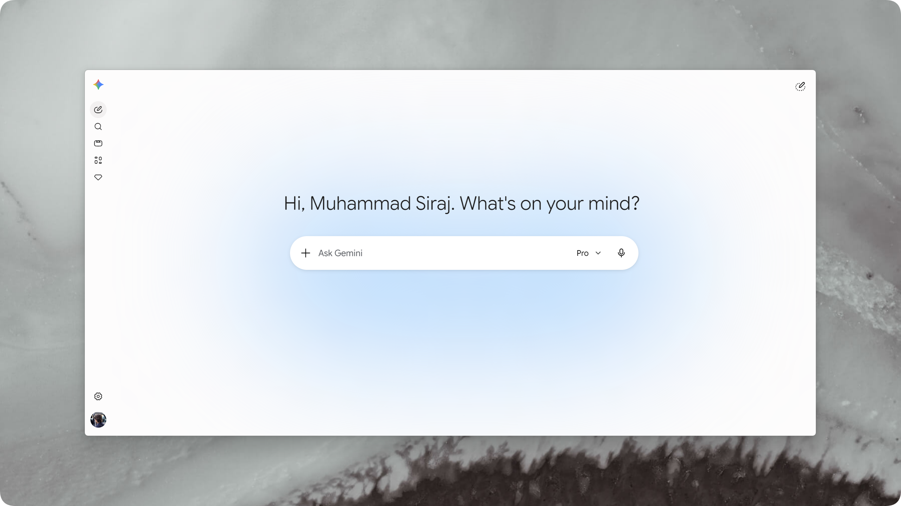
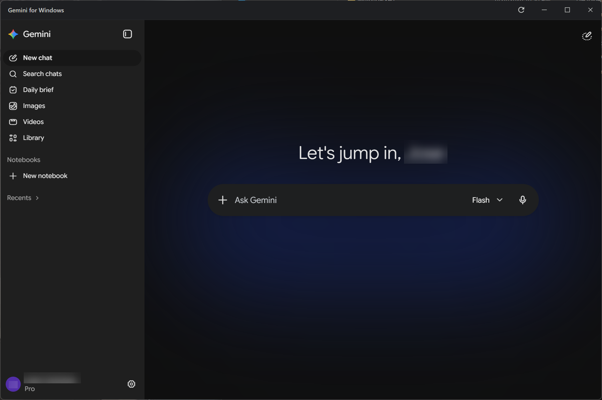

<div align="left">
  
  <h1>Google Gemini for Windows Redux</h1>
<p align="right">
  
  
  
</p> 
  <p>A sleek, native & frameless desktop client bringing Google Gemini™ directly to your PC (Redux version with improvements).</p>
</div>

<h5>If you enjoy the project or find it useful, consider dropping a ⭐ on the repository!</h5>

## ✦ Download & Install

**[Download the latest `.exe` release here](https://github.com/meridianfresco/gemini-for-windows-redux/releases)**

1. Download the latest `Gemini Desktop Setup 1.0.0.exe` from the Releases page.
2. Run the installer.
3. Access Gemini seamlessly from your Windows App List or System Tray!

*(Note: Because this is a free, open-source project without a paid corporate certificate, Windows SmartScreen may show a 'Windows protected your PC' warning. To run the app, click More Info -> Run Anyway. You can view the full source code and build it yourself to verify its safety.).*

---

## ✦ Features

* **Sleek Custom HTML Titlebar:** Custom-built frameless titlebar featuring a window title, page reload button, and Windows 11 style window controls (minimize, maximize/restore, and close) integrated directly into the window canvas with absolute vertical alignment.
* **Dynamic Theme Integration:** Automatically monitors Google Gemini's visual theme settings at runtime. Transitions the titlebar background, borders, title text, and button hover styles seamlessly between Dark and Light mode presets.
* **No Chrome, Neural Expressive:** No browser tabs, no URL bars, no native window borders. Just a dedicated, clean, borderless desktop app experience.
* **System Tray Integration:** Closing the app window minimizes it to the Windows System Tray, allowing it to run efficiently in the background. Restore the window instantly by double-clicking the tray icon.
* **Auto-Hide Menu Bar:** A standard application menu template (File, Edit, Options, View, Window, Help) that auto-hides itself during use. Pressing the **Alt** or **F10** key toggles its display.
* **Spellcheck & Context Menu:** Embedded Electron spellchecker with local dictionary additions and right-click spelling suggestions, alongside common copy/paste actions and browser navigation controls.
* **Single-Instance Enforcement:** Prevents multiple wrapper processes from launching concurrently. Opening a new window automatically reveals, focuses, and restores the active instance.
* **Performance Enhancements:** Configured V8 engine memory pool size to 4GB (`--max-old-space-size=4096`) to guarantee fluid interactions, quick response times, and prevent stutters.
* **Idle Memory Cleanup:** Refreshes and clears browser cache automatically after 1 hour of background idle time to conserve memory (safely checks if you have any unsaved text drafts in text fields before reloading).
* **Secure Login:** Script-free, secure PassKey and Google account login utilizing an internal Firefox User-Agent.

### Light Theme


### Dark Theme


---

## ✦ Building from Source

For Developers wanting to look into the Code:

### Prerequisites
Make sure you have [Node.js](https://nodejs.org/) installed on your machine.

### Instructions

1. **Clone the repository** (or download the source ZIP):
   ```bash
   git clone https://github.com/meridianfresco/gemini-for-windows-redux.git
   ```
2. **Navigate to the directory**:
   ```bash
   cd gemini-for-windows-redux
   ```
3. **Install dependencies**:
   ```bash
   npm install
   ```
4. **Run the app locally** (for testing):
   ```bash
   npm start
   ```
5. **Compile to a `.exe`**:
   ```bash
   npm run build:win
   ```
   > You will find the compiled executable installer in the `dist-electron` folder.

---

## ✦ About & Credits

This is a fork/Redux of the original [Gemini-for-Windows](https://github.com/muhammadsirajulhaq/Gemini-for-Windows) wrapper by [muhammadsirajulhaq](https://github.com/muhammadsirajulhaq).

**Redux Enhancements by [@meridianfresco](https://github.com/meridianfresco):**
* **Custom HTML Titlebar & Controls:** Replaced native window frame with an inline HTML titlebar, reload command, and custom Windows 11 window controls.
* **Dynamic Theme Syncing:** Programmed classname and computed style tracking to dynamically switch the titlebar theme at runtime.
* **Spelling Suggestions & Context Menu:** Integrated Electron's spellchecker, dictionary additions, text tools, and navigation context menus.
* **Menu Bar Improvements:** Added standard menu layout with auto-hide behavior and **Alt**/**F10** keypress hooks.
* **Memory Pool Limits:** Increased V8 heap size limits to 4GB for optimized execution speeds.
* **Single-Instance Enforcement:** Added single instance locking and automatic window restoring.
* **Idle Background Refresh:** Created an idle-time draft checker and cache-clearing reloader.

This wrapper is based on Electron for a borderless PWA of *'gemini.google.com'*.

<h5> Usage Rights & License:

This project is licensed under the **MIT License**. You are free to use, modify, distribute, and build upon this code for personal and commercial purposes. </h5>

> *Disclaimer: This project is not affiliated, associated, authorized, endorsed by, or in any way officially connected with Google LLC. "Gemini" is a registered trademark of Google LLC.*
